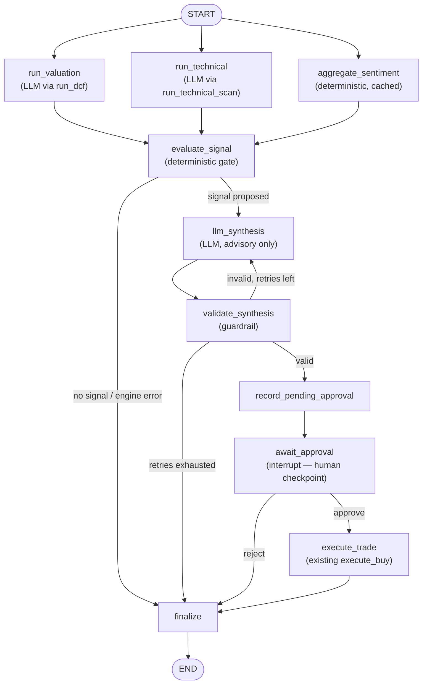

# Trading Bot

Personal automated trading bot — see `trading_bot_requirements.md` (from our
earlier conversation) for the full spec this scaffold implements.

## Setup

```bash
# 1. Activate your venv (should already exist from terminal setup)
source venv/bin/activate

# 2. Install dependencies
pip install -r requirements.txt

# 3. Set up environment variables
cp .env.example .env
# then fill in .env with your real keys — never commit this file

# 4. Initialize the database (once DATABASE_URL is set in .env)
python -c "from db.session import init_db; init_db()"

# 5. Run the API locally
uvicorn api.main:app --reload
```

Visit `http://127.0.0.1:8000/docs` for the interactive API docs once running.

## Project structure

```
trading-bot/
├── api/                        # FastAPI app — dashboard endpoints, kill switch
│   └── main.py
├── engine/
│   ├── valuation_engine/       # DCF, earnings quality, ticker deep-dive
│   │   ├── dcf.py
│   │   └── deep_dive.py
│   ├── price_action_engine/    # Technical indicators + scanner
│   │   ├── indicators.py
│   │   └── technical_scanner.py
│   ├── news_sentiment/         # News fetching + LLM sentiment scoring
│   │   └── sentiment.py
│   └── entry_exit/             # Combines all signals, gated by risk rules
│       └── signals.py
├── backtesting/
│   └── backtest_runner.py      # vectorbt-based backtesting + walk-forward
├── broker/
│   ├── alpaca_client.py        # Recommended default broker
│   └── robinhood_client.py     # Unofficial, via robin_stocks
├── functions/                  # Azure Functions logic (wire up triggers when deploying)
│   ├── after_hours_research.py
│   └── market_hours_trading.py
├── agent/                       # Supervised LangGraph workflow (see below)
│   ├── graph.py
│   ├── nodes.py
│   └── llm_synthesis.py
├── db/
│   ├── models.py                # Trade, Position, ResearchNote, NewsItem, GraphDecisionLog
│   └── session.py
└── dashboard/                   # Electron + React desktop dashboard
```

## Before this trades real money

- [ ] Fill in all `TODO`s — this scaffold is structure, not finished logic
- [ ] Define concrete numeric thresholds for your screening criteria (Section 1 of the requirements doc)
- [ ] Wire up real data injection into the LLM modules — none of them should run on empty context
- [ ] Implement and test risk management rules (max position size, stop-loss, daily loss limit, kill switch)
- [ ] Run backtesting with walk-forward validation before paper trading
- [ ] Run in paper trading mode (`ALPACA_PAPER=true` or Robinhood on a small test amount) before going live
- [ ] Move secrets to Azure Key Vault before any real deployment

## Unattended paper operation

The bot now uses shared server-side entry limits, a durable order journal,
broker-held protection, and a separate position supervisor. Start with the
[deployment and paper-validation guide](deploy/README.md). Paper mode remains
the default; changes to live mode alone cannot authorize live submissions.

## Supervised trade workflow (LangGraph)

The 30-second autonomous loop above has no human in it by design — it's the
proven, fast path. Alongside it, `agent/` is a second, opt-in workflow built
on [LangGraph](https://github.com/langchain-ai/langgraph) that runs the exact
same deterministic engines but pauses for explicit human approval before any
paper trade executes.

The point isn't "an agent framework is used here." It's where AI is
deliberately *not* trusted: valuation math, technical indicators, and the
buy/sell gate (`evaluate_entry`) are 100% deterministic Python, reused
unmodified from the autonomous path. Claude only gets one job in this
graph — interpret already-computed evidence and flag risks — and a guardrail
node checks its output against the numbers it was given before a human ever
sees it. Claude can never override a risk control or invent a trade the
deterministic gate wouldn't have proposed on its own.



**Deterministic nodes:** `aggregate_sentiment`, `evaluate_signal`,
`validate_synthesis`, `record_pending_approval`, `execute_trade`, `finalize`.
**LLM nodes:** `run_valuation`/`run_technical` (only on a cache miss — they
call the same engines the autonomous loop's research job does) and
`llm_synthesis` (the one genuinely new LLM call this feature adds).

### Running it

```bash
curl -X POST http://127.0.0.1:8000/graph/MSFT/run -H "X-API-Token: $TOKEN"
# -> pauses, returns the proposed signal + Claude's analysis + guardrail result

curl -X POST http://127.0.0.1:8000/graph/<thread_id>/resume \
  -H "X-API-Token: $TOKEN" -d '{"decision": "approve"}'
# -> only now does a paper order actually get submitted

curl http://127.0.0.1:8000/graph/pending -H "X-API-Token: $TOKEN"   # everything awaiting a decision
```

### Every run is logged — this is the evaluation dataset

Every graph run writes a `GraphDecisionLog` row (`db/models.py`), win or
lose, signal or no signal: the deterministic engine inputs (DCF, technical,
sentiment), Claude's structured analysis, whether the guardrail passed and
how many retries it took, the human's decision, and the final execution
result or error. It's written once by `finalize()` regardless of how the
run ended, so a run that never reaches a human is just as auditable as one
that does.

That table is deliberately never read by `evaluate_entry`/`execute_buy` —
it's a one-way audit trail, not a feedback loop into live decisions. It's
also got three reserved, currently-unused columns (`future_price_1d/7d/30d`)
for a later offline job to fill in by checking each ticker's price after the
fact. Once that's populated, this table directly answers the questions that
actually matter for judging an agent, not just shipping one: was the signal
right, was Claude's confidence calibrated, did its synthesis step improve or
degrade the deterministic baseline, and which engine's input mattered most
when it was.

See `tests/test_graph_orchestration.py` for the full behavioral spec: retry
on guardrail failure, safe termination on retry exhaustion, approval,
rejection, missing/stale data, and risk-rule rejection at execution.
